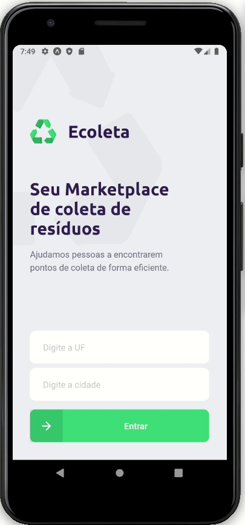

<!-- banner -->
<h1 align="center">
  
</h1>

<!-- título -->
<h1 align="center">
  ♻️ Ecoleta
</h1>

<!-- descrição -->
<h2 align="center">
  Seu marketplace de coleta de resíduos. Ajudamos pessoas a encontrarem pontos de coletas de forma eficiente.
</h2>

<!-- badges -->
<p align="center">
  
  <image src="https://img.shields.io/github/last-commit/hbalardin/nlw-01-ecoleta"/>
  
</p>

<!-- status -->
<p align="center"><b>Status: Concluído ✅</b></p>

---

<!-- index -->
<p align="center">
  <a href="#-sobre">Sobre</a> •
  <a href="#-funcionalidades">Funcionalidades</a> •
  <a href="#-tecnologias">Tecnologias</a> •
  <a href="#-executando-o-projeto">Executando o projeto</a> •
  <a href="#-licença">Licença</a> •
  <a href="#-versões-do-readme">Versões do README</a>
</p>

---

## 📄 Sobre

O objetivo do **Ecoleta** é conectar empresas de coleta de resíduos, com pessoas que precisam de um local adequado para o descarte de lixo.

Este projeto foi desenvolvido durante a primeira **NLW (Next Level Week)**. 

A **NLW** é um evento online de uma semana,  disponibilizado pela **RocketSeat**, focado em por a mão na massa. O conteúdo fica disponível apenas durante o evento.

---

## 🔝 Funcionalidades

Empresas podem registrar-se pela plataforma web, basta preencher o formulário.

Pelo aplicativo, os usuários podem navegar pelo mapa e encontrar pontos de coleta na sua região, podendo entrar contato com as empresas via whatsapp ou email.

<!-- gifs -->
<p align="center">
  
  
</p>

---

## 🔨 Tecnologias

Estas são as principais tecnologias utilizadas na construção do projeto:

- [Typescript](https://www.typescriptlang.org/)
- [Node.js](https://nodejs.org/en/)
- [ReactJS](https://reactjs.org/)
- [React Native](https://reactnative.dev/)
- [Expo](https://expo.io/)

---

## 🚀 Executando o projeto

Antes de qualquer coisa, você precisa ter  o [Git](https://git-scm.com) e o [Node.js](https://nodejs.org/en/) instalado na sua máquina. Feito isso, você pode prosseguir.

### 📂 Instalando dependências

```bash
# Clone este repositório:
$ git clone https://github.com/hbalardin/nlw-01-ecoleta

# Acesse à pasta do projeto:
cd nlw-01-ecoleta

# Vá à pasta server:
cd server

# Instale as depêndencias:
npm install

# Vá à pasta web:
cd ../web

# Instale as depêndencias:
npm install

# Vá à pasta mobile:
cd ../mobile

# Instale as depêndencias:
npm install

# Volte à pasta do projeto:
cd ..
```

---

### 💾 Rodando o servidor (back-end)

Antes de rodar o servidor pela primeira vez, você precisa criar o banco de dados.

```bash
# Vá à pasta server:
cd server

# Crie o banco de dados:
npm run knex:migrate

# Preencha as tabelas:
npm run knex:seed

# Execute o server em modo de desenvolvimento:
npm run dev
```

---

### 💻 Rodando a aplicação web (front-end)

Com o servidor rodando, abra um novo terminal e entre na pasta do projeto.

```bash
# Vá à pasta web:
cd web

# Execute o site em modo de desenvolvimento:
npm run start
```
Caso a página não abrir automaticamente, acesse: http://localhost:3000

---

### 📱 Rodando o aplicativo (mobile)

Você pode optar por baixar o aplicativo expo em **seu smartphone** ou instalar um **emulador**.

- Assista este vídeo da RocketSeat com o passo a passo para a instalação de um emulador:

- <a href="https://www.youtube.com/watch?v=eSjFDWYkdxM">
  </img>
</a>

Com o servidor e o emulador rodando, abra um novo terminal e entre na pasta do projeto.

```bash
# Vá à pasta mobile:
cd web

# <<Se você estiver utilizando emulador>>
# Crie a aplicação android (ou IOS):
npm run android # (ou IOS)

# <<Se você estiver utilizando seu smartphone>>
# Execute o aplicativo em modo de desenvolvimento:
npm run start
``` 

- PS: Para o aplicativo funcionar, é preciso [configurar o projeto](#-configurando-ip) com o IP da sua máquina.

---

#### ⚙️ Configurando IP

<p align="center">
  
</p>

Como no gif acima, substitua o **"localhost"** pelo **endereço IP da sua máquina** nos arquivos:

1. mobile -> src -> services -> api.ts
2. web -> src -> services -> api.ts
3. server -> src -> controllers -> ItemsController.ts
4. server -> src -> controllers -> PointsController.ts
5. server -> src -> controllers -> PointsController.ts

---

## 📋 Licença

Esse repositório está sobe a licença [MIT](https://github.com/hbalardin/nlw-01-ecoleta/blob/master/LICENSE.md).

Desenvolvido por Henrique Balardin dos Santos 🚀 [Entre em contato!](https://www.linkedin.com/in/hbalardin)

---

## 🚩 Versões do README

- [Português 🇧🇷](https://github.com/hbalardin/nlw-01-ecoleta/blob/master/README.md) | [Inglês 🇺🇸](https://github.com/hbalardin/nlw-01-ecoleta/blob/master/README-en.md)